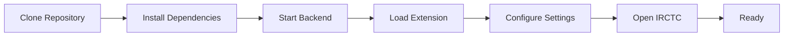
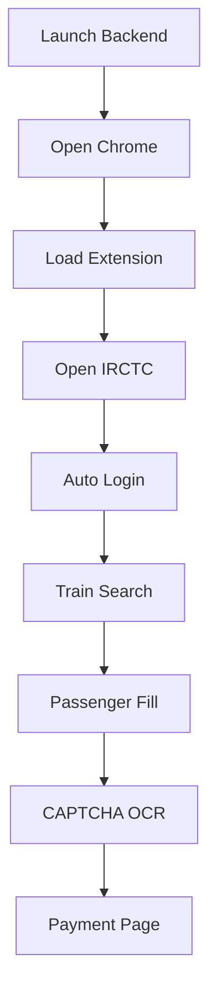

# <div align="center">


# 🚆 IRCTC Premium Tatkal Assistant

### Lightning-Fast IRCTC Automation Suite

<p align="center">


</p>

### ⚡ Intelligent Booking Assistant for Premium Tatkal & Tatkal Reservations

Automate login, train selection, passenger entry, CAPTCHA processing and booking workflows through a Chrome Extension powered by a Python backend.

</div>

---

# 🎬 Demo

## Complete Booking Flow

<p align="center">

</p>

> Replace with actual recording later.

---

## Extension Dashboard

<p align="center">

</p>

---

## OCR CAPTCHA Recognition

<p align="center">

</p>

---

# ✨ Key Features

<table>
<tr>
<td width="50%">

### 🎯 Smart Train Finder

* Automatic train discovery
* Train number targeting
* Class filtering
* Quota support
* Fast search execution

</td>

<td width="50%">

### 🔐 Login Automation

* Username autofill
* Password autofill
* Session management
* Quick authentication

</td>
</tr>

<tr>
<td>

### 🤖 OCR CAPTCHA Solver

* EasyOCR Integration
* Local processing
* No external APIs
* Fast recognition

</td>

<td>

### 🖱 Hardware Mouse Engine

* Real OS clicks
* PyAutoGUI powered
* Bypass UI limitations
* Accurate interactions

</td>
</tr>
</table>

---

# 🏗 System Architecture

```text
┌──────────────────────────────┐
│          USER                │
└──────────────┬───────────────┘
               │
               ▼
┌──────────────────────────────┐
│      CHROME EXTENSION        │
│                              │
│  popup.js                    │
│  content.js                  │
│  train-finder.js             │
└──────────────┬───────────────┘
               │
               ▼
┌──────────────────────────────┐
│       IRCTC WEBSITE          │
└──────────────┬───────────────┘
               │
               ▼
┌──────────────────────────────┐
│       PYTHON BACKEND         │
│                              │
│ Flask API                    │
│ EasyOCR                      │
│ PyAutoGUI                    │
└──────────────────────────────┘
```

---

# 📦 Installation

## Installation Flow



---

## Clone Repository

```bash
git clone https://github.com/YOUR_USERNAME/IRCTC-Premium-Tatkal-Assistant.git

cd IRCTC-Premium-Tatkal-Assistant
```

---

## Install Dependencies

```bash
pip install flask
pip install flask-cors
pip install pyautogui
pip install easyocr
pip install pillow
pip install opencv-python
pip install numpy
```

---

## Run Backend

```bash
python main.py
```

Expected:

```text
Initializing OCR Reader...
OCR Reader Ready

Listening on:
http://localhost:5000
```

---

# 🧩 Chrome Extension Setup

### Step 1

Open:

```text
chrome://extensions
```

### Step 2

Enable:

```text
Developer Mode
```

### Step 3

Select:

```text
Load Unpacked
```

### Step 4

Choose project folder.

---

# ⚙ Configuration

Fill:

```text
Username
Password
From Station
To Station
Journey Date
Train Number
Quota
Class
Passenger Details
Payment Method
```

Click:

```text
Save Preferences
```

---

# 🔄 Booking Workflow



---

# 🌐 Backend APIs

## Mouse Click Endpoint

```http
POST /click
```

Request

```json
{
  "x":500,
  "y":300
}
```

---

## OCR Endpoint

```http
POST /solve_captcha
```

Request

```json
{
  "base64":"IMAGE_DATA"
}
```

Response

```json
{
  "status":"success",
  "text":"ABC123"
}
```

---

# 📂 Project Structure

```text
IRCTC-Premium-Tatkal-Assistant/

├── main.py
├── config.json

├── manifest.json
├── popup.html
├── popup.js

├── content.js
├── train-finder.js

├── background.js

├── icons/

├── assets/
│   ├── banner-dark.png
│   ├── demo-full.gif
│   ├── dashboard-preview.gif
│   └── captcha-demo.gif

└── README.md
```

---

# 🛠 Technology Stack

| Technology            | Purpose             |
| --------------------- | ------------------- |
| Python                | Backend Engine      |
| Flask                 | API Server          |
| EasyOCR               | OCR Engine          |
| PyAutoGUI             | Mouse Automation    |
| Chrome Extensions API | Browser Integration |
| JavaScript            | Automation Logic    |
| HTML/CSS              | UI                  |

---

# 📸 Screenshots

## Dashboard


---

## Train Selection


---

## Passenger Configuration


---

## OCR Result


---

# 🔒 Security

Never upload:

```gitignore
config.json
.env
credentials.json
*.log
```

Recommended:

```gitignore
config.json
.env
__pycache__/
*.log
```

---

# 🚀 Roadmap

* [ ] Advanced OCR Models
* [ ] Android Companion App
* [ ] Smart Train Prediction
* [ ] Passenger Profiles
* [ ] Booking Analytics
* [ ] Notification System
* [ ] Multi-Account Support

---

# 🤝 Contributing

```bash
Fork
  ↓
Create Branch
  ↓
Commit Changes
  ↓
Push
  ↓
Pull Request
```

---

# ⭐ Support

If this project helps you:

⭐ Star the repository

🍴 Fork the project

🛠 Contribute improvements

---

# 📜 Disclaimer

This project is provided for educational and research purposes only.

Users are solely responsible for ensuring compliance with applicable website terms, policies, and regulations.

---

<div align="center">


# 🚨 IMPORTANT LEGAL NOTICE & WARNING

<div align="center">

# ⚠️ ⚠️ ⚠️ WARNING ⚠️ ⚠️ ⚠️


</div>

---

> [!WARNING]
> **This project is NOT affiliated with, endorsed by, authorized by, or associated with IRCTC (Indian Railway Catering and Tourism Corporation) in any way.**

---

## 🚫 Use At Your Own Risk

This software is provided solely for:

* Educational purposes
* Research purposes
* Browser automation learning
* OCR experimentation
* Software engineering demonstrations

The authors do **NOT** encourage, promote, or endorse the use of this software to violate any website's Terms of Service, policies, regulations, or applicable laws.

---

## ⚠️ IRCTC Terms & Conditions

IRCTC may prohibit or restrict activities such as:

* Automated booking
* Automated form submission
* Automated login
* Use of bots
* Use of scripts
* CAPTCHA bypass attempts
* Unauthorized automation tools
* High-frequency requests
* Automated ticket purchasing

Users should review the latest IRCTC Terms of Service and policies before using any software that interacts with IRCTC systems.

---

# 🔴 CAPTCHA WARNING

<div align="center">

## ⛔ CAPTCHA BYPASS MAY VIOLATE WEBSITE POLICIES ⛔

</div>

The CAPTCHA-related components included in this project are intended for:

* OCR research
* Image processing research
* Educational demonstrations

Using OCR systems or automation tools to circumvent, defeat, bypass, or interfere with CAPTCHA protections may violate the policies or terms of service of websites.

---

# 🚨 ACCOUNT SUSPENSION RISK

> [!CAUTION]
> Using automation tools on websites may result in actions taken by the website operator.

Potential consequences may include:

* Temporary account restrictions
* Account suspension
* Permanent account bans
* Booking limitations
* Additional verification requirements
* IP-based restrictions
* Security investigations

The project authors cannot prevent or reverse any actions taken by website operators.

---

# 🛑 NO GUARANTEE OF SUCCESS

This project does not guarantee:

* Successful ticket booking
* CAPTCHA recognition accuracy
* Availability of trains
* Faster booking speeds
* Protection from account actions
* Compliance with third-party policies

Website behavior, layouts, security systems, and policies may change at any time.

---

# ⚖️ USER RESPONSIBILITY

By using this software, you acknowledge that:

✅ You are responsible for your own actions.

✅ You are responsible for reviewing applicable website policies.

✅ You accept any risks associated with automation.

✅ You understand that website operators may restrict automated activity.

✅ You assume full responsibility for how this software is used.

---

# ❌ LIABILITY DISCLAIMER

THE SOFTWARE IS PROVIDED "AS IS", WITHOUT WARRANTY OF ANY KIND.

THE AUTHORS, CONTRIBUTORS, MAINTAINERS, AND DISTRIBUTORS SHALL NOT BE LIABLE FOR:

* Account suspensions
* Account bans
* Ticket cancellations
* Financial losses
* Service interruptions
* Data loss
* Legal claims
* Any direct or indirect damages arising from use of this software

---

<div align="center">

# 🚨 USE RESPONSIBLY 🚨

### ⚠️ ALWAYS RESPECT WEBSITE TERMS OF SERVICE ⚠️

### ⚠️ ALWAYS REVIEW IRCTC POLICIES BEFORE USE ⚠️

### ⚠️ AUTOMATION MAY RESULT IN ACCOUNT RESTRICTIONS ⚠️

</div>

---


### Built with Python • Flask • EasyOCR • Chrome Extensions

</div>
